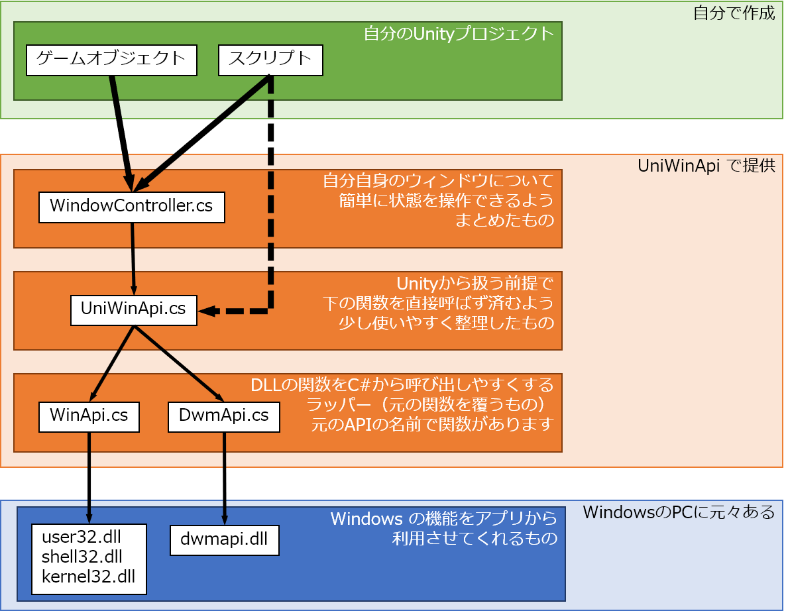
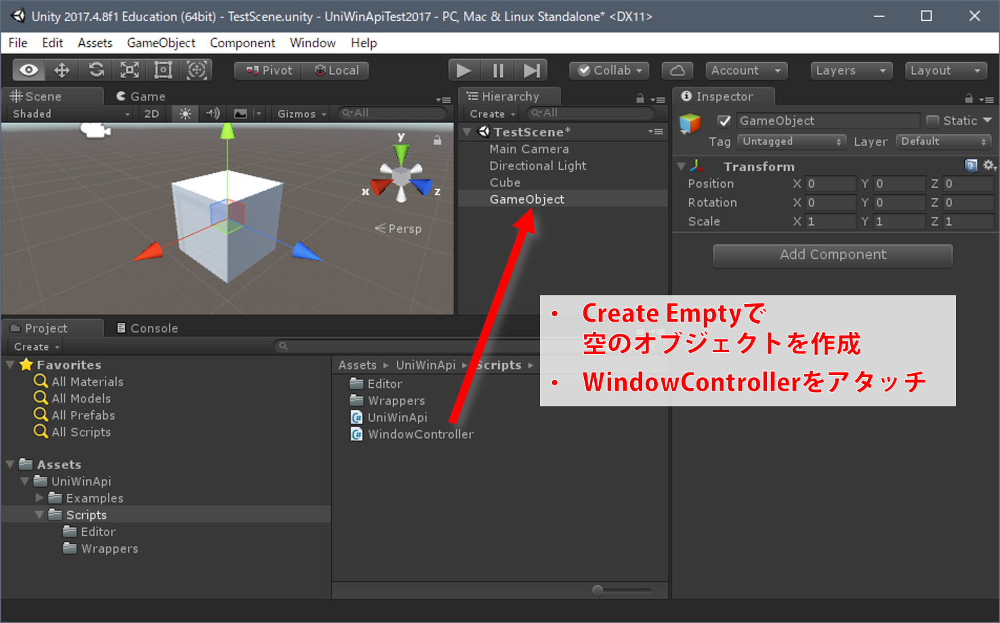
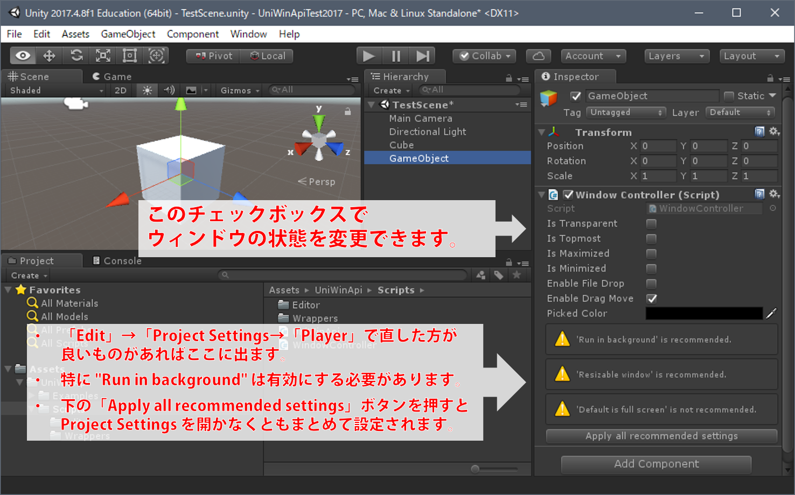

# UniWinApi チュートリアル

## 構成

UniWinApi の構成は図のようになっています。



利用する上では、黒い太矢印の部分を考えていただくことを想定しています。
* A. WindowController.cs を使う
* B. UniWinApi.cs をスクリプトから扱う

という2通りありますが、単に自分のウィンドウを枠なしにしたいということであれば、A. だけで大丈夫です。


## A. WindowController の利用　…　通常の利用

WindowController.cs を利用することで、自分のウィンドウ（起動したUnityのウィンドウ）について操作ができます。

枠なしウィンドウ、すなわち描画されているピクセルのみを操作できるようにして、非矩形（四角形でない）ウィンドウのように扱う仕組みは、このクラスで行っています。


### A-1. 簡単な使い方　枠なしウィンドウにする

1. 適当なゲームオブジェクトに、WindowController.cs をアタッチする
	* アタッチ対象はなんでもよいのですが、複数アタッチはしないでください。挙動がおかしくなるかもしれません。
	* 空のオブジェクトに WindowController という名前を付けておき、それにアタッチするなどがお勧めです。

	

2. インスペクタで設定を変更
	* 「Is Transparent」にチェックを付けておけば、枠なしウィンドウになります。
	* 「Enable Drag Move」にチェックが入っていると、マウス左ボタンでのドラッグがウィンドウ移動になります。無効にしたい場合はチェックを外してください。

	

3. Windows PCのスタンドアローンとしてビルド、実行
	* 起動して、設定しておいたようになれば成功です。

以上です。

エディタで再生中にインスペクタから変更することで、変化を確認できます。  
ただしエディタ上では枠なしにはなりません。ビルドをして確認する必要があります。


### A-2. WindowCotnroller のプロパティ

下記をインスペクタ、またはスクリプトから設定できます。

|項目名          |内容          |
|---------------|--------------|
|isTransparent |枠なしにする    |
|isTopmost     |常に最前面にする|
|isMaximized   |最大化する     |
|isMinimized   |最小化する     |
|enableFileDrop|ファイルドロップを受け付ける|
|enableDragMove|マウス左ボタンドラッグをウィンドウ移動とする|


### A-3. スクリプトから操作する

実行中に設定を変更したい場合、スクリプトから WindowsController のインスタンスに対して操作してください。

例えば、次のような内容のスクリプトを、WindowController をアタッチしたのと同じゲームオブジェクトにアタッチしておくと、Endキーで枠なしを切り替えられます。

```csharp
WindowController myWindowController;

Start() {
	myWindowController = GetComponent<WindowController>();
}

Update () {
	if (Input.GetKeyDown(KeyCode.End)) {
		myWindowController.isTransparent = !myWindowController.isTransparent;
	}
}
```

`isTransparent` などはプロパティになっており、値の取得、設定のどちらもできます。


### A-4. ファイルドロップを利用する

`enableFileDrop` を true にしてあれば、`OnFilesDropped` というイベントでドロップされたファイルに対する処理を行えます。

```csharp
myWindowController.OnFilesDropped += FileDropped;

private void FileDropped(string[] files) {
	// ドロップされたファイルに対する処理
	foreach (var path in files) {
		Debug.Log(path);
	}
}
```


## B. UniWinApi を直接利用する使い方

### B-1. ウィンドウハンドルの取得

まず、対象となるウィンドウを探します。

```csharp
// 自分のウィンドウ（アクティブなウィンドウ）を取得する例
var windowHandle = UniWinApi.FindWindow();
```

|メソッド                |動作|
|-----------------------|----|
| UniWinAPi.FindWindow()|アクティブなウィンドウ（通常、自分のウィンドウ）を返します|
| UniWinAPi.FindWindowByTitle(string title)|タイトルからウィンドウを探します|
| UniWinAPi.FindWindowByClass(string class)|クラス名からウィンドウを探します|
| UniWinAPi.FindWindows()|現在存在するウィンドウの一覧を配列で返します|


### B-2. インスタンスの生成

ウィンドウが決まったら、インスタンスを生成します。

```csharp
// 先に取得したウィンドウハンドルを指定してインスタンス生成
var uniWin = new UniWinApi(windowHandle);
```

### B-3. ウィンドウの操作

インスタンスができれば、紐づいたウィンドウの操作ができます。  
ただし操作するメソッド名などは WindowController とは別になっています。  
どのようなものがあるかは、ソースをご覧ください。  
（仕様が固まっていない面があります。）


### B-4. マウスを操作する

スクリプトから、Windows 上のマウスを動かしたり、ボタンを押させることができます。  
これは静的メソッドなのでインスタンスは不要です。

```csharp
// 今のマウスカーソル位置を取得
Vector2 pos = UniWinApi.GetCursorPosition();

// 20px 右にずらしてみる
pos.x += 20f;

// マウスカーソル位置を設定
UniWinApi.SetCursorPosition(pos);

// 右ボタンが押されたことにする
UniWinApi.SendMouseDown(1);

// 右ボタンが離されたことにする
UniWinApi.SendMouseUp(1);
```
